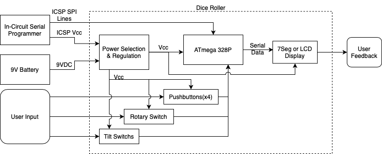

# Team 2 Dice Roller - Product Design Specification
### Group Members: Stephen Short, Michael Weston, Drew Seidel, Braden Harwood
### Date: 10/21/2021, Version: 1.0

## Executive Summary
The electronic dice roller is a small device with a display and widgets that can roll multiples of the commonly used dice in table-top games (d4, d6, d20, fudge dice, etc.). It allows the user to roll up to nine dice at a time and conveniently displays the total score for that roll, as well as the roll of each die rolled. The purpose of this device is to give people who enjoy tabletop games - or other activities that involve dice - the ability to easily and quickly roll several dice in satisfying and fun ways (buttons, shaking device, etc.). This eliminates the need to carry several types of dice or roll one type of dice several times. From Fudge to Bunco, the electronic dice roller provides a fun, innovative, and efficient way to play.

## Market Analysis
The electronic dice roller is intended for consumers who enjoy playing tabletop games that have a dice rolling component to them. For example, Dungeons and Dragons utilizes many different sided dice in various combinations. It is not uncommon for these same consumers to enjoy technology and novelty products. Our dice roller would be both while still being fully functional. 

There are a few competing products in the market already, the [eDice](https://www.kickstarter.com/projects/1758784647/edice-an-universal-electronic-dice-for-your-tabletop-games) and [eDice 2](https://www.kickstarter.com/projects/1758784647/edice-2-an-universal-electronic-dice-for-tabletop-games), the [Pixel](https://www.kickstarter.com/projects/pixels-dice/pixels-the-electronic-dice) electronic dice, and smartphone apps. The eDice uses a simple LCD screen and a few buttons to control their device, but our product will allow a more mechanical method of controlling the device through the rotary coder. The Pixel dice are just amazing since they are wireless dice that transmit their rolls to a smartphone app but are very expensive. Finally, smartphone apps are useful but lack the novelty of a physical device.

Our price will depend on our bill of materials needed to satisfy all of our requirements. We expect that we should be able to market our product for around $35 to $40. The eDice sells for $45 each, the Pixels sell a set for $199, and smartphone apps can vary from free to a few dollars. With this lower price and unique physical design, we should be able to sell the product easily.

## Requirements

- Must be able to simulate up to nine dice rolling at once

- Must be able to roll the commonly used dice sizes (d4, d6, d8, d10, d20, d100)

- Must display the total of all dice after a roll on a screen

- Must preview the number and types of dice that will be rolled to the user

- Must allow the user to dynamically set the number and type of dice to be rolled for each roll

- Must be powered from a battery

- Should be able to be powered from the In-Circuit Serial Programmer (ICSP) or battery

- Should provide user with three different ways to roll dice, e.g., button, shaking motion

- May provide user with the individual result of each dice after a roll

- May allow the user to roll ‘fudge’ dice 

- May display previous rolls.

- May have an enclosure.

## System Architecture

## Design Specification

- Will use an ATmega328P

- Will use an Arduino bootloader

- Will be programmed from the Arduino IDE via ICSP

- Will use a 4 digit 7 segment display or a 2x16 LCD

- If an LCD is used, it will utilize a serial protocol to communicate in order to conserve GPIO pins on the CPU

- Will use no more than four pushbuttons for user input

- Will use a rotary switch for user input

- May use one or two tilt switches for user input to detect shaking

- Power selectively drawn from ICSP Vcc (primary) and a 9VDC battery (alternate)

- Battery will have a voltage regulator to pull input voltage down to 5V

- Will have an on/off switch to secure power to the device and disconnect the battery to preserve power.

- Will not reverse power the ICSP Vcc pin

